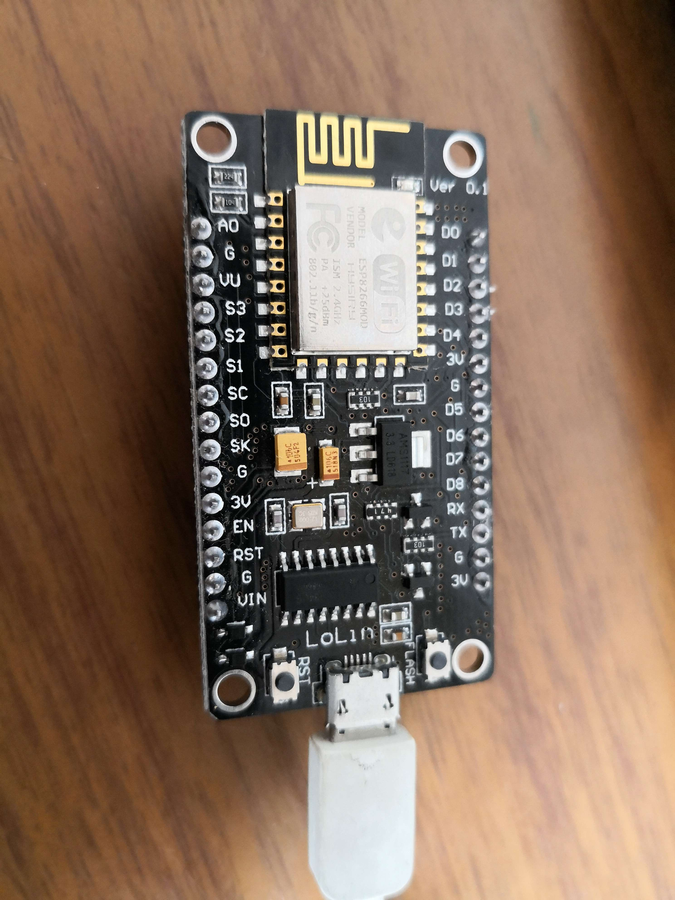
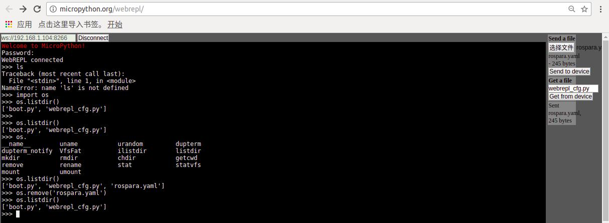

# MicroPython On ESP8266  

硬件采用一块ESP8266的nodemcu模组  

## 烧录镜像  

### 下载镜像和工具
- 镜像下载：http://www.micropython.org/download#esp8266  
- 工具安装：'pip install esptool'  
> 这是用来flash firmware到esp8266的工具  

### 刷镜像  
1. 将nodemcu的节点权限设为777  
<pre><code>
LearnMicroPython$ ls -l /dev/ttyUSB0  
crw-rw---- 1 root dialout 188, 0 10月 22 11:54 /dev/ttyUSB0
LearnMicroPython$ sudo chmod 777 /dev/ttyUSB0 
LearnMicroPython$ ls -l /dev/ttyUSB0 
crwxrwxrwx 1 root dialout 188, 0 10月 22 11:54 /dev/ttyUSB0
</code></pre>

2. 按住FLASH按钮，用以下指令擦除flash里的数据  
<pre><code>
$ esptool.py --port /dev/ttyUSB0 erase_flash
esptool.py v1.2
Connecting...
Running Cesanta flasher stub...
Erasing flash (this may take a while)...
Erase took 0.5 seconds
</code></pre>

3. 按住FLASH按钮，用以下指令刷firmware  
<pre><code>
$ esptool.py --port /dev/ttyUSB0 --baud 115200 write_flash --flash_size=32m -fm dio 0x00000 esp8266-20170823-v1.9.2.bin 
esptool.py v1.2
Connecting...
Running Cesanta flasher stub...
Flash params set to 0x0240
Writing 602112 @ 0x0... 602112 (100 %)
Wrote 602112 bytes at 0x0 in 52.2 seconds (92.2 kbit/s)...
Leaving...
</code></pre>

4. 用picocom与nodemcu串口链接，建立链接后按RST按键重启nodemcu就可以看到python终端了  
<pre><code>
$ sudo picocom -b 115200 /dev/ttyUSB0 
</code></pre>

## 在线终端与脚本上传  

ESP8266虽然可以通过串口调试，但不能通过类似U盘的形式将脚本拷贝到芯片里。  
不过可以通过webrepl传输，具体方法如下：  
1. 通过串口设置webrepl
<pre><code>
import webrepl_setup
</code></pre>
2. 通过串口设置连接到与PC相同网段的wifi。（或设置AP模式，而PC连接到ESP8266）  
3. 打开'http://micropython.org/webrepl/'  
4. 设置IP地址为ESP8266的IP  
之后就能改在浏览器中与ESP8266交互，和上传下载文件了。  

> **设置WiFi的方法**  
<pre><code>
>>> help()
Welcome to MicroPython!

For online docs please visit http://docs.micropython.org/en/latest/esp8266/ .
For diagnostic information to include in bug reports execute 'import port_diag'.

Basic WiFi configuration:

import network
sta_if = network.WLAN(network.STA_IF); sta_if.active(True)
sta_if.scan()                             # Scan for available access points
sta_if.connect("<AP_name>", "<password>") # Connect to an AP
sta_if.isconnected()                      # Check for successful connection
# Change name/password of ESP8266's AP:
ap_if = network.WLAN(network.AP_IF)
ap_if.config(essid="<AP_NAME>", authmode=network.AUTH_WPA_WPA2_PSK, password="<password>")

Control commands:
  CTRL-A        -- on a blank line, enter raw REPL mode
  CTRL-B        -- on a blank line, enter normal REPL mode
  CTRL-C        -- interrupt a running program
  CTRL-D        -- on a blank line, do a soft reset of the board
  CTRL-E        -- on a blank line, enter paste mode

For further help on a specific object, type help(obj)
>>> 
</code></pre>
> [1] [关于REPL的官方文档](http://docs.micropython.org/en/latest/esp8266/esp8266/tutorial/repl.html)
