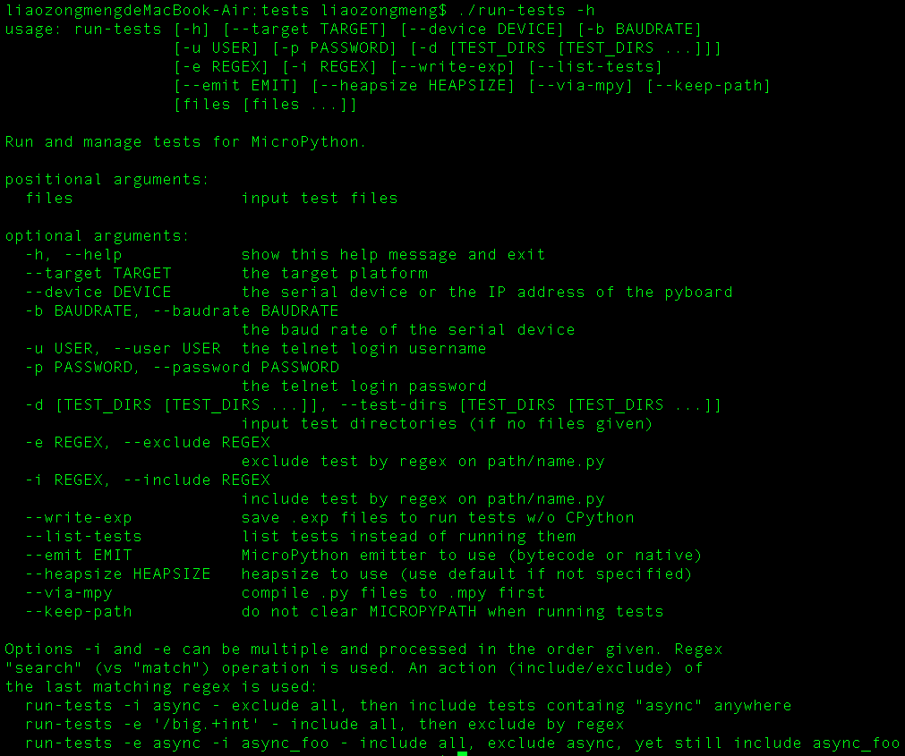
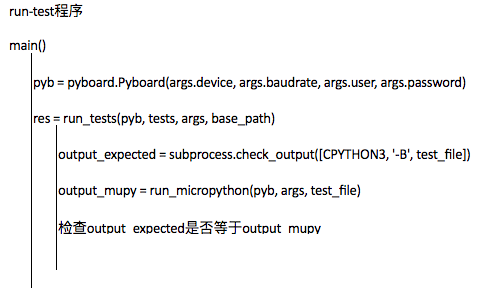

# MicroPython On ESP8266  

硬件采用一块ESP8266的nodemcu模组  

## 烧录镜像  

### 下载镜像和工具
- 镜像下载：http://www.micropython.org/download#esp8266  
- 工具安装：'pip install esptool'  
> 这是用来flash firmware到esp8266的工具  

### 刷镜像  
1. 将nodemcu的节点权限设为777(检查是否有可写权限，若无，添加之)  
<pre><code>
LearnMicroPython$ ls -l /dev/ttyUSB0  
crw-rw---- 1 root dialout 188, 0 10月 22 11:54 /dev/ttyUSB0
LearnMicroPython$ sudo chmod 777 /dev/ttyUSB0 
LearnMicroPython$ ls -l /dev/ttyUSB0 
crwxrwxrwx 1 root dialout 188, 0 10月 22 11:54 /dev/ttyUSB0
</code></pre>
> 如果找不到串口，请先安装CH340串口芯片的驱动

2. 按住FLASH按钮，用以下指令擦除flash里的数据  
<pre><code>
$ esptool.py --port /dev/ttyUSB0 erase_flash
esptool.py v1.2
Connecting...
Running Cesanta flasher stub...
Erasing flash (this may take a while)...
Erase took 0.5 seconds
</code></pre>

3. 按住FLASH按钮，用以下指令刷firmware  
<pre><code>
$ esptool.py --port /dev/ttyUSB0 --baud 115200 write_flash --flash_size=32m -fm dio 0x00000 esp8266-20170823-v1.9.2.bin 
esptool.py v1.2
Connecting...
Running Cesanta flasher stub...
Flash params set to 0x0240
Writing 602112 @ 0x0... 602112 (100 %)
Wrote 602112 bytes at 0x0 in 52.2 seconds (92.2 kbit/s)...
Leaving...
</code></pre>

4. 用picocom与nodemcu串口链接，建立链接后按RST按键重启nodemcu就可以看到python终端了  
<pre><code>
$ sudo picocom -b 115200 /dev/ttyUSB0 
</code></pre>

## 在线终端与脚本上传  

ESP8266虽然可以通过串口调试，但不能通过类似U盘的形式将脚本拷贝到芯片里。  
不过可以通过webrepl传输，具体方法如下：  
1. 通过串口设置webrepl
<pre><code>
import webrepl_setup
</code></pre>
2. 通过串口设置连接到与PC相同网段的wifi。（或设置AP模式，而PC连接到ESP8266）  
3. 打开'http://micropython.org/webrepl/'  
4. 设置IP地址为ESP8266的IP  
之后就能改在浏览器中与ESP8266交互，和上传下载文件了。  

> **设置WiFi的方法**  
<pre><code>
>>> help()
Welcome to MicroPython!

For online docs please visit http://docs.micropython.org/en/latest/esp8266/ .
For diagnostic information to include in bug reports execute 'import port_diag'.

Basic WiFi configuration:

import network
sta_if = network.WLAN(network.STA_IF); sta_if.active(True)
sta_if.scan()                             # Scan for available access points
sta_if.connect("<AP_name>", "<password>") # Connect to an AP
sta_if.isconnected()                      # Check for successful connection
# Change name/password of ESP8266's AP:
ap_if = network.WLAN(network.AP_IF)
ap_if.config(essid="<AP_NAME>", authmode=network.AUTH_WPA_WPA2_PSK, password="<password>")

Control commands:
  CTRL-A        -- on a blank line, enter raw REPL mode
  CTRL-B        -- on a blank line, enter normal REPL mode
  CTRL-C        -- interrupt a running program
  CTRL-D        -- on a blank line, do a soft reset of the board
  CTRL-E        -- on a blank line, enter paste mode

For further help on a specific object, type help(obj)
>>> 
</code></pre>  

## MicroPython On Esp8266 编译环境  
1. [安装esp-open-sdk](https://github.com/pfalcon/esp-open-sdk)
2. [参考micropython/ports/esp8266的指导下载编译源码](https://github.com/micropython/micropython/tree/master/ports/esp8266)

## 自动化测试  
### 测试的执行方法  

对于ESP8266，按如下指令执行测试：  
<pre><code>
./run-tests --target esp8266 --device /dev/tty.wchusbserial1420
</code></pre>
### 测试的原理  

## 源码详解  

### MicroPython部分  
> 参考  
> 1. Python 源码剖析  

#### MicroPython中对象的表示  
MicroPython中所有对象需在结构体的开始包含一个*mp_obj_base_t*类型的实例  
它仅包含一个*mp_obj_type_t*元素指针，指向描述该对象的类型对象（类型对象是描述一类对象的对象，通常包含对所表述对象相关操作的方法）  
> 和CPython不同的是，CPython还包含一个引用计数，意味着MicroPython的内存管理机制与CPython应该会有不同
<pre><code>
# py/obj.h
// Anything that wants to be a concrete MicroPython object must have mp_obj_base_t
// as its first member (small ints, qstr objs and inline floats are not concrete).
struct _mp_obj_base_t {
    const mp_obj_type_t *type MICROPY_OBJ_BASE_ALIGNMENT;
};
typedef struct _mp_obj_base_t mp_obj_base_t;
</code></pre>  

*mp_obj_type_t*结构体用于构建类型对象（int、str、float等都是类型对象），类型对象也是对象，所以他的第一个元素是*mp_obj_base_t*。   

<pre><code>
# py/obj.h
// This mp_obj_type_t struct is a concrete MicroPython object which holds info
// about a type.  See below for actual definition of the struct.
typedef struct _mp_obj_type_t mp_obj_type_t;
...
struct _mp_obj_type_t {
    // A type is an object so must start with this entry, which points to mp_type_type.
    mp_obj_base_t base;

    // The name of this type.
    qstr name;

    // Corresponds to __repr__ and __str__ special methods.
    mp_print_fun_t print;

    // Corresponds to __new__ and __init__ special methods, to make an instance of the type.
    mp_make_new_fun_t make_new;

    // Corresponds to __call__ special method, ie T(...).
    mp_call_fun_t call;

    // Implements unary and binary operations.
    // Can return MP_OBJ_NULL if the operation is not supported.
    mp_unary_op_fun_t unary_op;
    mp_binary_op_fun_t binary_op;

    // Implements load, store and delete attribute.
    //
    // dest[0] = MP_OBJ_NULL means load
    //  return: for fail, do nothing
    //          for attr, dest[0] = value
    //          for method, dest[0] = method, dest[1] = self
    //
    // dest[0,1] = {MP_OBJ_SENTINEL, MP_OBJ_NULL} means delete
    // dest[0,1] = {MP_OBJ_SENTINEL, object} means store
    //  return: for fail, do nothing
    //          for success set dest[0] = MP_OBJ_NULL
    mp_attr_fun_t attr;

    // Implements load, store and delete subscripting:
    //  - value = MP_OBJ_SENTINEL means load
    //  - value = MP_OBJ_NULL means delete
    //  - all other values mean store the value
    // Can return MP_OBJ_NULL if operation not supported.
    mp_subscr_fun_t subscr;

    // Corresponds to __iter__ special method.
    // Can use the given mp_obj_iter_buf_t to store iterator object,
    // otherwise can return a pointer to an object on the heap.
    mp_getiter_fun_t getiter;

    // Corresponds to __next__ special method.  May return MP_OBJ_STOP_ITERATION
    // as an optimisation instead of raising StopIteration() with no args.
    mp_fun_1_t iternext;

    // Implements the buffer protocol if supported by this type.
    mp_buffer_p_t buffer_p;

    // One of disjoint protocols (interfaces), like mp_stream_p_t, etc.
    const void *protocol;

    // A pointer to the parents of this type:
    //  - 0 parents: pointer is NULL (object is implicitly the single parent)
    //  - 1 parent: a pointer to the type of that parent
    //  - 2 or more parents: pointer to a tuple object containing the parent types
    const void *parent;

    // A dict mapping qstrs to objects local methods/constants/etc.
    struct _mp_obj_dict_t *locals_dict;
};
</code></pre>

#### Type对象的定义  
<pre><code>
# py/objtype.c
const mp_obj_type_t mp_type_type = {
    { &mp_type_type },
    .name = MP_QSTR_type,
    .print = type_print,
    .make_new = type_make_new,
    .call = type_call,
    .unary_op = mp_generic_unary_op,
    .attr = type_attr,
};
</code></pre>

#### 基本数据类型  
##### int  
整数对象包含一个基本对象类型的实例，和一个用于存放整数数值的元素（有两种整数机制LONGLONG和MPZ）  
base->type是一个指向*mp_type_int*类型对象的指针  
<pre><code>
# py/objint.h
typedef struct _mp_obj_int_t {
    mp_obj_base_t base;
#if MICROPY_LONGINT_IMPL == MICROPY_LONGINT_IMPL_LONGLONG
    mp_longint_impl_t val;
#elif MICROPY_LONGINT_IMPL == MICROPY_LONGINT_IMPL_MPZ
    mpz_t mpz;
#endif
} mp_obj_int_t;
</code></pre>

<pre><code>
# py/objint.c
const mp_obj_type_t mp_type_int = {
    { &mp_type_type },
    .name = MP_QSTR_int,
    .print = mp_obj_int_print,
    .make_new = mp_obj_int_make_new,
    .unary_op = mp_obj_int_unary_op,
    .binary_op = mp_obj_int_binary_op,
    .locals_dict = (mp_obj_dict_t*)&int_locals_dict,
};
</code></pre>
##### str  
##### float  

#### 基本数据结构  
##### dict  
##### list  
##### tuple  

#### 内存管理  

### MicroPython On ESP8266部分
> 参考
> 1. MicroPython On ESP8266基于[NON-OS SDK](http://espressif.com/sites/default/files/documentation/5a-esp8266_sdk_ssl_user_manual_cn_v1.4.zip)开发，与ESP8266平台相关的代码要参考官方SDK文档。  
>2. [官方关于MicroPython On ESP8266的文档](http://docs.micropython.org/en/latest/esp8266/esp8266/general.html)：介绍了ESP8266具有的资源，解释了这颗芯片的资源限制。

#### ESP8266 NON-OS SDK笔记
1. <code>void user_init(void)</code> 是程序的入口。
2. <code>system_init_done_cb(init_done);</code> 注册系统初始化完成之后的回调函数 <code>init_done</code>
3. ⽤户任务可以分为三个优先级：0、1、2。任务优先级为 2 > 1 > 0。即 Non-OS SDK 最多只⽀持 3 个⽤户任务，优先级分别为 0、1、2。  
⽤户任务⼀般⽤于函数不能直接被调⽤的情况下。要创建⽤户任务，请参阅本⽂档中的 <code>system_os_task()</code> 的 API 描述。

#### 入口函数解析(main.c)
<pre><code>
...
void init_done(void) {
    #if MICROPY_REPL_EVENT_DRIVEN
    uart_task_init();
    #endif
    mp_reset();
    mp_hal_stdout_tx_str("\r\n");
    #if MICROPY_REPL_EVENT_DRIVEN
    pyexec_event_repl_init();
    #endif

    #if !MICROPY_REPL_EVENT_DRIVEN
soft_reset:
    for (;;) {
        if (pyexec_mode_kind == PYEXEC_MODE_RAW_REPL) {
            if (pyexec_raw_repl() != 0) {
                break;
            }
        } else {
            if (pyexec_friendly_repl() != 0) {
                break;
            }
        }
    }
    soft_reset();
    goto soft_reset;
    #endif
}

void user_init(void) {  // 程序入口
    system_init_done_cb(init_done);   // 初始化完成后调用回调函数init_done
}
...
</code></pre>

## 参考  
1. [Micropython on ESP8266官方文档](http://docs.micropython.org/en/latest/esp8266/esp8266/tutorial/index.html)
2. [MicroPython实现分析与移植](http://m.blog.chinaunix.net/uid-30044407-id-5766697.html)
3. [MicroPython Github站点](https://github.com/micropython/micropython)
4. [ESP8266 官方文档](http://espressif.com/zh-hans/support/download/documents)
5. [Python源码剖析](https://read.douban.com/reader/ebook/1499455/)
